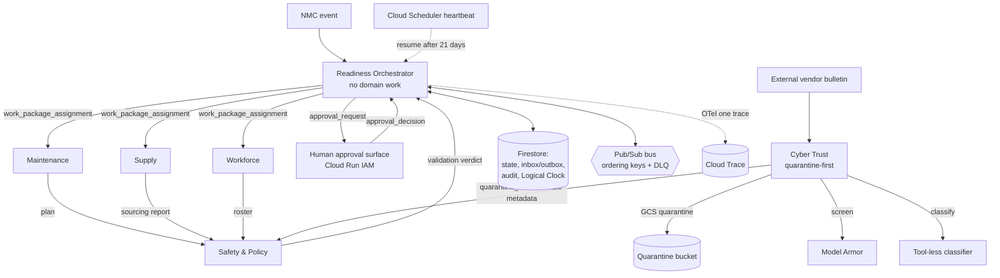

# FORGE — Devpost submission

Paste-ready copy for the Devpost fields, plus the architecture diagram. Keep
this in sync with `README.md`; the README is authoritative for setup.

- **Project name:** FORGE — Fleet Operational Readiness & Governed Execution
- **Track / category:** The Fortified Enterprise Fleet
- **Entrant:** Dr. Armond E. Sinclair — **solo individual entry**. "Anansi
  Labs" is the entrant's professional affiliation only; not a team or company
  entry; any prize payable to the entrant personally.
- **Repository:** https://github.com/asin2000/forge (private — **must be
  shared** with `testing@devpost.com` and `cloudhackathons@google.com` before
  SUB-7; see Open items — grant collaborator access on GitHub and confirm)
- **Frozen artifact:** git tag `v1.3-demo` (advances from `v1.2-demo.3`
  when the v1.3 operator-console re-acceptance completes; see README
  Acceptance & evidence)
- **Hosted URL:** the operator console (read-only except the audited HUM-1
  approvals and HUM-3 operator controls) runs on Cloud Run behind IAM
  (`--no-allow-unauthenticated`), so it is not publicly reachable by
  design; the demo video shows it live. Per the rules, the app need not be
  publicly live at judging — reproducibility is proven by the repo + the
  one-command `infra/deploy.sh`.

## Elevator description

FORGE is a governed, multi-agent "fleet" that autonomously recovers
non-mission-capable ground-support equipment across weeks of asynchronous
operation. A manager agent decomposes each breakdown into exclusively-owned
work packages for five specialist agents; humans approve the two consequential
actions; every external document is quarantined and screened before anything
it says can touch the bus; and the whole run reconstructs from an append-only
audit trail and a single distributed trace. All data is synthetic.

## Features & functionality

- **Agent discovery (Agent Registry).** Declarative `agents/registry.yaml`
  loaded to Firestore; capability-based discovery; an Agent Catalog in the
  console with health *derived* from heartbeat staleness. Definition and
  instance lifecycle changes emit audit events (REG-1..5).
- **A drivable live demo (operator console, HUM-3).** Judges don't have to
  take the video's word for it: an authenticated operator can start a
  recovery (injecting the same `nmc_event` the field would emit), cancel it
  (an audited terminal state; late bus traffic drains as audited no-ops),
  advance the Logical Clock, inject the poisoned bulletin through the live
  quarantine path, and fail/restore an agent instance — every action
  recorded in the audit trail with the operator's authenticated identity,
  and a live activity feed shows the agents working in real time.
- **Weeks of asynchronous context (Agent Runtime + Memory).** A Logical Clock
  drives a real 21-day part-delay: the workflow suspends, and a scheduled
  heartbeat resumes it when the simulated ETA arrives — state, inbox/outbox,
  and audit all persist in Firestore across the gap (ORC-5).
- **Human-in-the-loop governance.** The only two irreversible actions —
  schedule override and equipment release — require an approval recorded with
  the approver's authenticated identity; the approval surface derives identity
  from the platform principal, never client input, and the decision record is
  fully inspectable (source refs, extracted facts, applicable rules,
  constraints, confidence, alternatives, versions) (HUM-1/HUM-2).
- **Zero-trust security & guardrails.** One Cloud Run service and service
  account per role; prohibited operations are denied *at Google IAM*, proven
  by a live negative-test matrix. External documents pass a quarantine-first
  pipeline (bounded parser → Model Armor → tool-less classifier); only a
  non-executable verdict + typed safe metadata reaches the bus (AGT-5/6,
  SEC-1..4, Model Armor).
- **Observability.** One OpenTelemetry trace per workflow to Cloud Trace, W3C
  context propagated across Pub/Sub hops, spans carry metadata only — never
  prompts, responses, or document content (OBS-1/OBS-2).
- **Reliability.** Transactional inbox/outbox with per-workflow ordering keys,
  idempotent under duplicate delivery, dead-letter after five attempts,
  exactly-once repair-loop reassignment to a held reserve (ICD-5/6, ORC-3/4).

## Technologies used

- **Gemini 3.5 Flash** via Vertex AI (all agent reasoning).
- **Google ADK** (`LlmAgent` + `Runner`) — pinned in `requirements.lock`.
- **Google Cloud:** Cloud Run (7 services), Firestore, Pub/Sub (regional
  endpoint + DLQ), Cloud Storage (quarantine), **Model Armor**, Cloud Trace,
  Cloud Logging, Cloud Scheduler, Artifact Registry, Cloud Build, per-role
  IAM service accounts.
- **OpenTelemetry** SDK + Cloud Trace exporter. FastAPI/uvicorn (approval
  surface + worker push runtime). Python 3.13.

## Other data sources

None external. All parts, qualifications, procedures, personnel, and the
vendor bulletin are synthetic fixtures under `data/` (SUB-5).

## Findings & learnings

- **Defense in depth is not rhetorical — we watched it save the run.** A
  *diluted* prompt injection in the vendor bulletin passed Model Armor
  (`clean`) live, and only the second layer — a tool-less classifier
  constrained to parser-extracted identifiers — flagged it (`malicious`);
  Safety then vetoed on the trusted registry. Either layer alone would have
  failed; the two in series held.
- **Every fact a model asserts needs a registry — in the prompt.** Ungrounded
  planners invented task codes and part numbers; grounding each specialist's
  prompt in the authoritative registry (and re-checking at the source) was the
  fix, discovered three separate times before it generalized.
- **The fake-vs-real client seam hides correctness bugs.** Real Firestore
  transactions return a generator, begin lazily on first read, and forbid
  reads-after-writes; an in-memory fake masked a total-message-loss bug until
  a real-emulator gate caught it. Emulator-verified ≠ deployment-verified —
  live Lane-2 runs then caught a stripped auth-token behavior, a 256-char
  Pub/Sub filter cap, and a missing dead-letter IAM grant.
- **Acceptance earns its keep.** A 10-consecutive-run gate failed twice before
  passing — each failure a real reliability gap a single lucky run would have
  shipped.

## Architecture

Each box (except the human and the external document) is its own Cloud Run
service with its own service account; the bus is Pub/Sub; state and audit are
Firestore. See `architecture/manifest.yaml` for the service → module map and
`docs/verification/` for live evidence.

## Open items before submit (entrant-owned — I cannot do these)

These require the entrant's own action on external sites/accounts; the audit
flagged each as unverifiable from the repo. None is an engineering blocker.

- [ ] **Demo video** recorded per `docs/DEMO_RUNBOOK.md` and its public
      URL added above (SUB-1/SUB-7) — the app-on-Google-Cloud proof.
- [ ] **Devpost submission created** and its management URL recorded here
      (SUB-7).
- [ ] **Private-repo access granted** to `testing@devpost.com` and
      `cloudhackathons@google.com`, and access confirmed accepted (SUB-3).
- [ ] **Eligibility self-certification** on the Devpost entry form: no
      government-agency employment and no real/apparent conflict of interest
      (Official Rules §3) — pertinent given the fictional defense-adjacent
      scenario.
- [ ] **$150 Google Cloud credits** redeemed via the Resources-tab form
      (https://forms.gle/5PtXmw1dSbDnpYke9) so usage bills to credit.

Everything engineering-side is frozen at `v1.2-demo` and live-validated
(see `docs/verification/`); the above are submission-portal and account
actions only.
